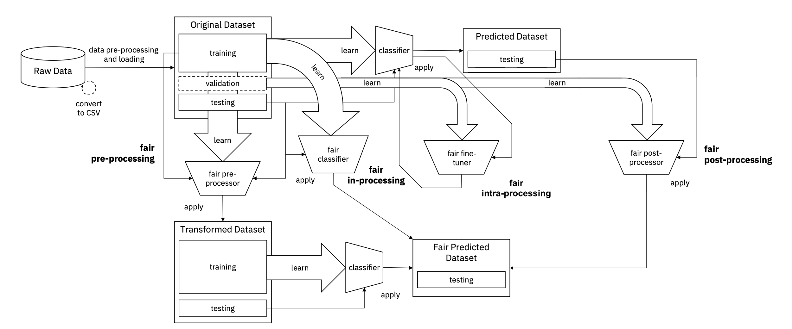

# Intra-Processing Methods for Debiasing Neural Networks

[Intra-Processing Methods for Debiasing Neural Networks](https://arxiv.org/abs/2006.08564)\
Yash Savani, Colin White, Naveen Sundar Govindarajulu.\
_Advances in Neural Information Processing Systems 33 (2020)_.

## A New Paradigm for Debiasing Research

In this work, we initiate the study of a new paradigm in debiasing research, _intra-processing_, which sits between in-processing and post-processing methods. Intra-processing methods are designed specifically to debias large models which have been trained on a generic dataset, and fine-tuned on a more specific task. We show how to repurpose existing in-processing methods for this use-case, and we also propose three baseline algorithms: random perturbation, layerwise optimization, and adversarial debiasing. All of our techniques can be used for all popular group fairness measures such as equalized odds or statistical parity difference. We evaluate these methods across three popular datasets from the [aif360](https://aif360.readthedocs.io/en/latest/modules/datasets.html) toolkit, as well as on the [CelebA](http://mmlab.ie.cuhk.edu.hk/projects/CelebA.html) faces dataset.

<p align="center">

</p>

## Requirements

To run this code you will need to be using at least python3.8.

Install the requirements using

```
$ pip install -r requirements.txt
```

## How to run tabular experiments

To run tabular experiments you can run the following command

```
$ python intraproc_tabular.py config_tabular.yml
```

To modify the parameters of the tabular experiment change the `config_tabular.yml` file. Below are some notes on what each parameter in the yaml file represents.

### yaml config tabular notes

- seed: the seed used for the experiment.
- experiment_name: prefix for output json file.
- dataset: Name of the dataset (one of adult, german, compas, or bank).
- protected: Protected variable to use for dataset (see `utils.py` for options).
- modelpath: Location of a trained model.
- objective: parameters for objective
- sharpness: How sharp the objective is.
- margin: absolute margin of objective.
- hyperparameters (optional): Additional hyperparameters to use if available.
  - num_deep: Number of layers.
  - hid: Dimension of hidden vector.
  - dropout_p: Dropout probability.
- metric: bias measure to use (one of spd, aod, eod).
- models: List of intra-processing models to compare.
- CalibEqOdds
  - cost_constraint: One of fpr, for, or weighted.
- random
  - num_trials: Number of random models to sample
  - stddev: How much to scale normal samples.
  - margin:
- adversarial
  - num_deep: Number of critic layers.
  - lr: Learning rate for the actor optimizer
  - epochs: Number of epochs to run the model for.
  - critic_steps: Number of steps critic takes.
  - batch_size: Size of batches.
  - actor_steps: Number of steps actor takes.
  - margin: Margin for loss objective.
  - sharpness: Sharpness for loss objective.
- mitigating
  - epochs: Number of epochs to run the model for.
  - critic_steps: Number of steps critic takes.
  - batch_size: Size of batches.
  - actor_steps: Number of steps actor takes.
  - alpha: Parameter to scale adversarial loss

## How to run CelebA experiments

To run the CelebA experiments you can run the following command

```
$ python intraproc_celeba.py config_celeba.yml
```

Modify the `config_celeba.yml` file to adjust the parameters of the tabular experiment. Below are some notes on what each parameter in the yaml file corresponds to. 
For the prediction and protected attributes, we used Smiling/Young, and 4-6 on the Fitzpatrick skin tone scale (Fitz_Dark).

### yaml config celebA notes

- seed: The seed used for the experiment.
- output: Prefix for output json file.
- protected_attr: Protected Attribute
- prediction_attr: Prediction Attribute.
- metric: Bias measure to use (one of spd, aod, eod).
- trainsize: Size of training dataset.
- testsize: Size of test dataset.
- num_workers: Number of workers for DataLoader.
- print_priors: Boolean for whether to print priors.
- retrain: Boolean for whether to retrain the model.
- optimizer: Optimizer to use when retraining the model (one of sgd, adam).
- batch_size: The batch size used for retraining.
- lr: Learning rate to use for retraining.
- epochs: Number of epochs in retraining.
- checkpoint: Suffix for checkpoint file.
- objective
  - epsilon: Minimum bias needed to be achieved for objective to be non-zero.
- models: List of intra-processing models to compare.
- CalibEqOdds
  - cost_constraint: One of fpr, for, or weighted.
- random
  - checkpoint: Where to save checkpoint files
- layerwiseOpt
  - max_sparsity: Maximum sparsity to constrain how many variables are tuned by GBRT.
  - num_layers: Number of final layers to tune.
- adversarial
  - margin: Margin for loss objective.
  - epochs: Number of epochs to run the model for.
  - critic_steps: Number of steps critic takes.
  - actor_steps: Number of steps actor takes.
  - lambda: coefficient used in the surrogate loss function.
  - checkpoint: Where to save checkpoint files.
